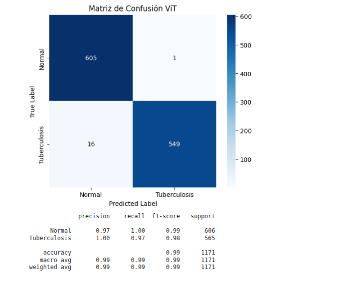
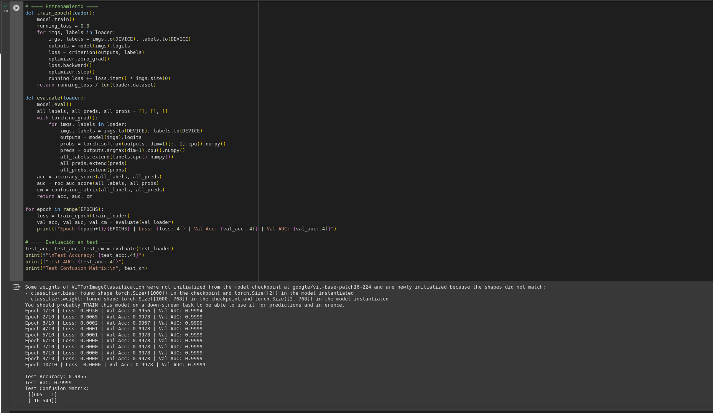

# ViT-Detection-TBC

# Detección de Tuberculosis en Radiografías de Tórax usando Vision Transformers

Este repositorio contiene el código y resultados para la detección automática de tuberculosis pulmonar en radiografías de tórax, utilizando modelos Vision Transformer (ViT) y transferencia de aprendizaje, como parte de mi tesis de licenciatura.

## 🖥️ Modelo y Dataset

- Modelo: ViT (Vision Transformer) preentrenado en ImageNet, ajustado para clasificación binaria (tuberculosis / normal).
- Dataset: El conjunto de datos (Dataset) de imágenes de rayos X del tórax para la Tuberculosis fue creado por un equipo de investigadores de la Universidad de Qatar, Doha, Qatar, y la Universidad
de Dhaka, Bangladesh, junto con sus colaboradores de Malasia en colaboración con médicos de Hamad Medical Corporation y Bangladesh , que consta de 3500 TB y 3500 radiografías normales.
- Framework: PyTorch + HuggingFace Transformers.

## 🚦 Resultados

- **Test Accuracy:** 98.55%
- **Test AUC:** 0.9999

**Matriz de confusión:**

## 📊 Visualizaciones

Ejemplo de matriz de confusión generada con seaborn (ver el notebook para más):

